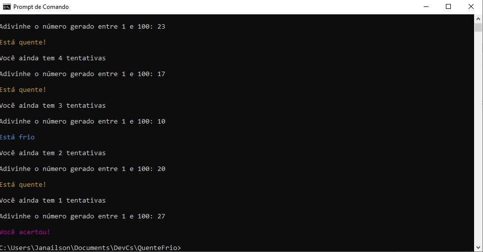

# QuenteFrio

Advinhe qual número aleatório de 1 a 100 foi escolhido.

Conforme as tentativas, o programa ajudará a saber se o número escolhido está perto ou longe de ser acertado.

## _Exemplo

```
---> QUENTE E FRIO <---

Pressione uma tecla para continuar...

```

## Screenshot



## Download 

Baixe aqui o donwload do arquivo .zip.
Descompacte na pasta desejada.

[Donwload do arquivo .zip](/dist/QuenteFrio.zip)

## Agradecimentos 

[Etec Adolpho Berezin](https://www.cps.sp.gov.br/etecs/etec-adolpho-berezin/)

[Ermógenes Palacio](https://github.com/ermogenes)

[Diego Neri](https://github.com/diegoneri)
